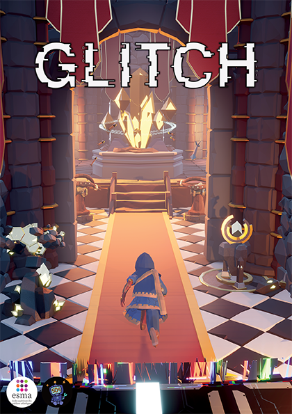

# Glitch

   

Glitch is a Tower Defense and Stealth PC game where the player controls a character in third person. The character evolves inside a medieval world corrupted by a strange void.
Fighting this corruption generates singularities in the whole world.

The player will have to progress quietly inside the corrupted world to identify key structures and reclaim them to bring back the world to it's original state. When the player finds their exploring is done, they shall survive incoming waves of enemies by building their own defenses.

# Run the project

You can download the [latest version of the game](https://github.com/MichenaudMelvin/Glitch/releases/latest) or run the project in Unreal Engine 4.27.x.

Run the project in UE4 requires [Microsoft Visual Studio](https://visualstudio.microsoft.com) and C++ extentions, [FMOD Plugin](https://www.fmod.com/download) (account required) and [PopcornFX Plugin for UE](https://www.popcornfx.com/plugin-unreal-engine/).

Plugins needs to be stored in [GlitchUE/Plugins] (You need to create the "Plugins" folder).